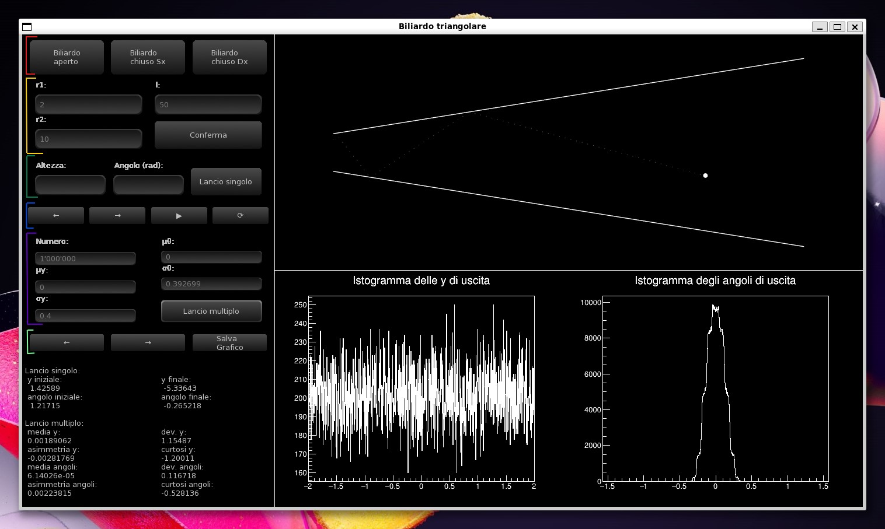
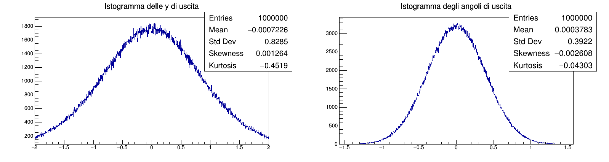
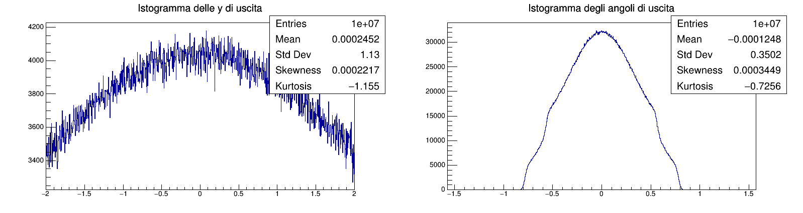
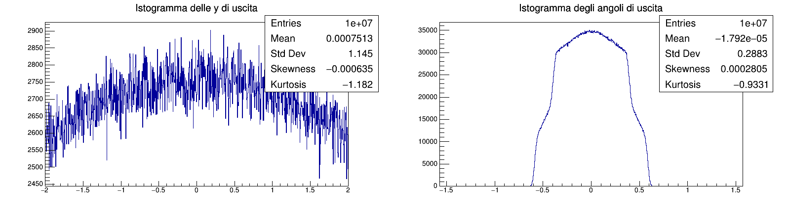
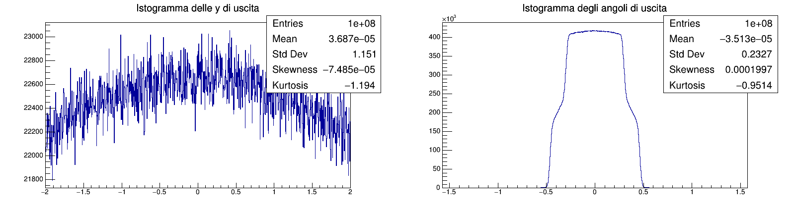
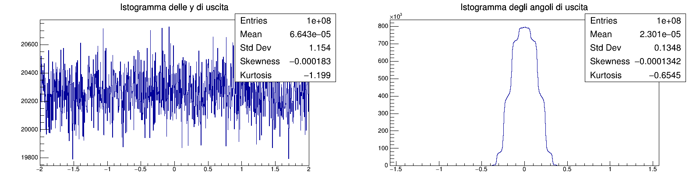
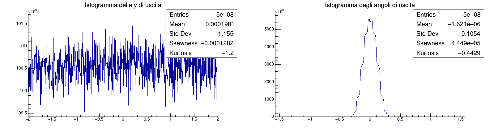
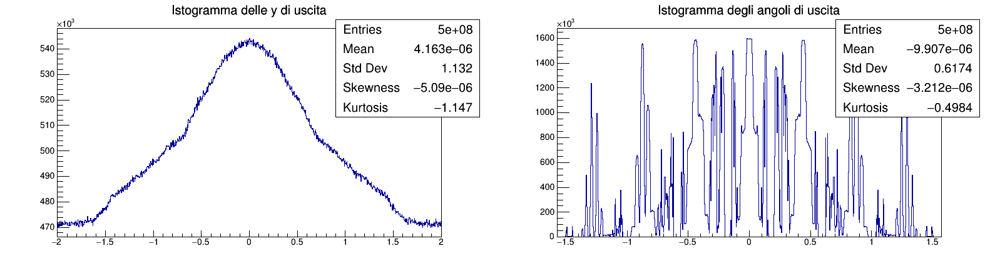

<h1 style="text-align: center">Simulazione della dinamica di un biliardo triangolare</h1>
<h3 style="text-align: center">Paolo Forni</h3>

## Indice

1. [Librerie utilizzate](#librerie-utilizzate)
2. [Struttura del progetto](#struttura-del-progetto)
3. [Funzionalità del programma](#funzionalità-del-programma)
4. [Scelte implementative](#scelte-implementative)
5. [Compilare, testare ed eseguire](#compilare-testare-ed-eseguire)
6. [Come utilizzare il programma](#come-utilizzare-il-programma)
7. [Risultati ottenuti](#risultati-ottenuti)
8. [Strategie di test](#strategie-di-test)

## Librerie utilizzate

- [SFML](https://github.com/SFML/SFML): libreria grafica per raffigurare immagini e intercettare eventi da tastiera e
  mouse
- [tgui](https://github.com/texus/TGUI): libreria per la creazione dell'interfaccia grafica (*graphic user interface*)
- [ROOT](https://github.com/root-project/root): framework per l'analisi dati, in questo progetto è usato solo per la
  creazione di grafici e il calcolo dei parametri statistici sul loro contenuto
- [boost](https://github.com/boostorg/boost): raccolta di librerie applicabili a innumerevoli ambiti
- [doctest](https://github.com/doctest/doctest): libreria per la creazione di *unit test*
- [benchmark](https://github.com/google/benchmark): libreria per effettuare benchmark simili a *unit test*

## Struttura del progetto

Il progetto è diviso in due parti:

1. La libreria TPool (*Triangular Pool*) che si occupa unicamente di eseguire la simulazione fisica.
2. Il programma biliardo_triangolare che fornisce un'interfaccia grafica per utilizzare le funzionalità di TPool.

Al livello del codice, il programma (TPoll compresa) è composto da 4 componenti fondamentali, ognuno rappresentato da
una classe:

|              |                                                                                                                                                                                                                                                                                                                                                                                        |
|:------------:|----------------------------------------------------------------------------------------------------------------------------------------------------------------------------------------------------------------------------------------------------------------------------------------------------------------------------------------------------------------------------------------|
|     App      | Gestisce la struttura a eventi su cui si basa il programma, detiene il possesso di tutti i dati generati dalla simulazione e contiene al suo interno un'istanza di tutte le altre classi del progetto; tramite i suoi metodi pubblici permette agli altri componenti di interagire con essa, mentre gli input dell'utente sono catturati utilizzando le apposite funzionalità di SFML. |
| Pool (TPool) | È responsabile della simulazione vera e propria, essa infatti si occupa di creare il contesto del biliardo, gestire la fisica dei rimbalzi e di generare delle condizioni di partenza valide quando queste non sono specificate dall'utente.                                                                                                                                           |
|   Designer   | Si occupa di tutto il comparto grafico della simulazione (non della *Gui*), è quindi responsabile della rappresentazione del biliardo, di quella dei grafici e dell'animazione dei lanci delle singole particelle.                                                                                                                                                                     |
|     Gui      | Gestisce l'interfaccia grafica dell'utente, quindi associare la chiamata di una funzione alla pressione di un bottone, leggere i dati inseriti nelle caselle di testo e aggiornare le scritte.                                                                                                                                                                                         |

## Funzionalità del programma


Nell'ordine con il quale compaiono nell'immagine:

- **Scelta del tipo di biliardo**: la libreria tpool permette di gestire biliardi sia aperti da entrambi i lati, sia
  chiusi da uno qualsiasi dei due; per fare ciò il programma presenta tre bottoni, uno per tipologia, nell'angolo in
  alto a sinistra (evidenziati in rosso nell'immagine).
  L'applicazione mantiene sempre in memoria i lanci associati a tutti i tipi di biliardo.
- **Scelta delle dimensioni del biliardo**: l'applicazione permette di modificare i parametri del biliardo a *run time*
  tramite gli appositi campi di testo e il bottone di conferma (evidenziati in giallo nell'immagine).
  I campi di testo riportano come *placeholder* i valori attuali dei vari parametri (basta inserire i dati dei campi che
  si vogliono modificare).
  **N.B. la modifica delle dimensioni del biliardo comporta il reset della memoria dei lanci!**
- **Lancio di una singola particella**: il programma è in grado di lanciare una singola particella il cui percorso verrà
  poi raffigurato nel riquadro in alto a destra della finestra; è possibile, ma non obbligatorio, indicare ordinata e/o
  direzione iniziali della particella tramite i campi appositi (evidenziati in verde scuro in figura) e poi premere il
  pulsante "lancio singolo" per dare il via alla simulazione.
- **Navigazione dei lanci singoli**: i bottoni evidenziati in blu permettono di navigare tra i lanci presenti in memoria
  e si dividono in due gruppi, il primo, costituito da quelli sulla sinistra (←, →), permette di scorre i lanci in
  memoria per il tipo di biliardo selezionato, il secondo, formato dai restanti, serve a mettere in pausa o far
  ripartire (▶), anche da capo (⟳), la riproduzione del lancio attualmente selezionato.
- **Lancio di più particelle**: per eseguire un lancio multiplo di N particelle create secondo due distribuzioni normali
  indipendenti, una per le ordinate e l'altra per le direzioni, sono messi a disposizione i campi di testo e il bottone
  evidenziati in viola, che permettono di impostare: numero di particelle e, media e deviazione standard delle due
  gaussiane; per ogni campo, se non compilato, è presente un valore di default indicato dal testo placeholder.
  I due istogrammi risultanti vengono poi visualizzati nel riquadro in basso a destra della finestra e i dati riportati
  sono relativi a tutte le particelle che escono dal biliardo, sia che escano da destra che da sinistra.
- **Navigazione e salvataggio dei grafici**: come per i lanci singoli, è possibile scorrere tutti gli istogrammi
  generati per l'attuale tipo di biliardo tramite i primi due bottoni del gruppo evidenziato in verde chiaro; l'ultimo
  bottone, come riportato dal suo stesso testo, permette di salvare il grafico selezionato, con un nome generato sulla
  base di data e ora attuali.
- **Leggere i risultati dei lanci**: i risultati dei lanci selezionati, sia il singolo che il multiplo, sono riportati
  nella sezione in basso a sinistra della finestra.

## Scelte implementative

### La classe Pool

La classe Pool non utilizza il polimorfismo dinamico per gestire i tre tipi di configurazione simulati dal
programma. <br>
Il motivo è che i vantaggi legati alla possibilità di riferirsi ai puntatori delle sottoclassi con dei puntatori della
classe madre non verrebbero sfruttati, visto che viene creata una singola istanza della classe Pool;
inoltre definire dei metodi diversi pre ogni sottoclasse sarebbe più lungo che tenerne conto in un unico metodo.

Per gestire i vari tipi di biliardo si utilizza invece il membro privato `type_` di tipo `PoolType`, un *unsigned enum*
utile anche per indicizzare gli array che contengono i dati riguardo i vari tipi di biliardo, e il metodo `Pool::isOut_`
che a seguito di un urto laterale determina con uno `switch` se esso comporta o meno la fuoriuscita della particella dal
biliardo.

### I membri App::singleLaunches_ e App::multipleLaunches_

Il tipo del membro `App::singleLaunches_` è `std::array<std::vector<std::shared_ptr<std::vector<double>>>, 3>` e farò
riferimento a questo ma lo stesso discorso è applicabile ad `App::multipleLaunches_`; innanzitutto è un `array` lungo 3
perché deve contenere separatamente i dati di tutti i tipi di biliardi, questi ultimi immagazzinati in un `vector`, dato
che voglio poterne tenere in memoria un numero arbitrario, ma non direttamente, bensì tramite degli `shared_ptr`. <br>
Questa struttura dati non è per nulla continua in memoria, ma permette una flessibilità necessaria al programma:

- Per quanto riguarda la non continuità, questo non dovrebbe essere un grande problema dato che è un oggetto di
  dimensioni tendenzialmente ridotte sul quale si deve iterare se non per distruggerlo o svuotarlo.
- L'intermediazione dello `shared_ptr` è necessaria dato che il metodo pubblico `App::singleLaunch` (e il corrispettivo
  `App::multipleLaunch`) deve ritornare, per praticità, il lancio appena effettuato a chi lo ha chiamato, ma deve anche
  assicurarsi che costui non si ritrovi ad usare un oggetto non valido nel caso questo venga distrutto a seguito di un
  cambio delle misure del biliardo; il metodo ritorna quindi un `weak_ptr` che se conservato sotto questa forma (o
  distrutto) non previene l'eventuale distruzione del lancio, ma impedisce all'utente di accedervi dopo di essa, se
  convertito e conservato come `shared_ptr` invece, impedisce la distruzione del lancio, permettendo comunque la pulizia
  di `App::singleLaunches_`.

## Compilare, testare ed eseguire

Una volta clonato il repository ed aver installato tutte le dipendenze, digitare i seguenti comandi per configurare la
build con cmake:

```shell
mkdir build && cd build; \
cmake .. [-DCMAKE_BUILD_TYPE=<Build-type>] -DBUILD_BENCHMARK=TRUE \
  -DBUILD_TESTING=TRUE [-DROOT_DIR=<path/to/ROOTConfig.cmake>]
```

Compilando in `RELEASE` mode si otterranno significativi miglioramenti nei lanci multipli soprattutto
all'aumentare del numero di particelle generate, se la forma del biliardo comporta molti rimbalzi per lancio.  
Per non compilare test e benchmark omettere i parametri o impostarli su `FALSE`.  
In base al tipo di installazione di ROOT, potrebbe non essere necessario specificare il parametro `ROOT_DIR`.

Una volta configurate le impostazioni di compilazione, avviare la build digitando:

```shell
cmake --build . [-j <N>]
```

Il parametro opzionale `-j N` imposta il numero di processori logici disponibili per il compilatore (in un sistema con 8
threads si puù impostare fino ad 8).

I binari generati si troveranno nella cartella `build` e nelle sue sottocartelle, e sono (percorsi relativi alla
cartella `build`):

- `biliardo_triangolare`: applicazione con interfaccia grafica (programma principale).
- `tests/app_test`: test della classe `App`.
- `tests/format_test`: test della funzione di validazione dell'input dell'utente.
- `TPool/libtpool.a` libreria statica che espone le funzionalità per eseguire le simulazioni nel biliardo
  triangolare.
- `TPool/tests/tpool_test`: test della classe `Pool`.
- `TPool/benchmark/poolBenchmark`: benchmark per le funzioni di lancio delle particelle e riempimento degli
  istogrammi.

## Come utilizzare il programma biliardo_triangolare

Le funzionalità sono elencate nella sezione [Funzionalità del programma](#funzionalità-del-programma). <br>
Ogni campo di testo è sottoposto ad un controllo di validità dell'input al momento della pressione del pulsante di
conferma (o simili), se questo dovesse rilevare un errore (e.g. una deviazione standard negativa oppure una stringa mal
formata), il valore non sarà cancellato ma colorato di rosso. <br>
Sono formati validi:

- 100 / +100 / -100 / 100.
- 100.2 / 100,2
- .100 / ,100
- 1e2 / 1e+2 / 1e-2 / 1E2 / 1E+2 / 1E-2
- 100 000 / 100'000

La finestra del programma è ridimensionabile, ma, seppur il biliardo e i grafici si adatteranno sempre alle sue
dimensioni, i testi non faranno lo stesso, rendendo impossibile leggere parti di testo o creando sovrapposizioni tra le
diverse stringhe; inoltre ad alte risoluzioni (e.g. 2K) il movimento della particella risulta scattoso e lento (anche se
gli fps rimangono fissi a 30), per via di come è implementato.

## Risultati ottenuti

Si è studiato il comportamento delle distribuzioni in uscita dal biliardo fissando i parametri `r1 = 2` e `r2 = 10` e
facendo variare `l` ed anche `N` per risolvere meglio alcuni effetti.

Risultati `l = 2`, `N = 1e6`:


Risultati `l = 10`, `N = 1e7`:


Risultati `l = 15`, `N = 1e7`:


Risultati `l =20`, `N = 1e8`:


Risultati `l = 40`, `N = 1e8`:


Risultati `l = 40`, `N = 5e8`:


Con lunghezze molto piccole le distribuzioni sono praticamente invariate.
Al crescere della lunghezza si nota come sia sempre più difficile risolvere la distribuzione delle y che si appiattisce
su una distribuzione uniforme, mentre la distribuzione degli angoli di uscita tende ad una forma "a gradini"
con due punte distinte in cima.

È interessante notare come il cambio del tipo di biliardo, in questo caso chiuso a dx possa influenzare le distribuzioni
in uscita.

Risultati chiudendo a destra il biliardo `l = 40`, `N = 5e8`:


## Strategie di test

Per tutti i costruttori e i setter delle classi `App` e `Pool` sono stati scritti dei test quasi omni comprensivi che
controllano che questi funzionino correttamente sia in caso di parametri corretti che errati. <br>
Per quanto possibile si sono testati anche i metodi di lancio controllando che fossero in grado di verificare
correttamente la validità dei parametri e, nel caso dei metodi di `App`, per assicurarsi che aggiornassero correttamente
gli indici e che generassero `weak_ptr` validi fino alla distruzione dei lanci.

È stata testata anche la funzione `format` responsabile di validare gli input dell'utente, controllando che invalidasse
tutte le possibili stringhe mal formate.